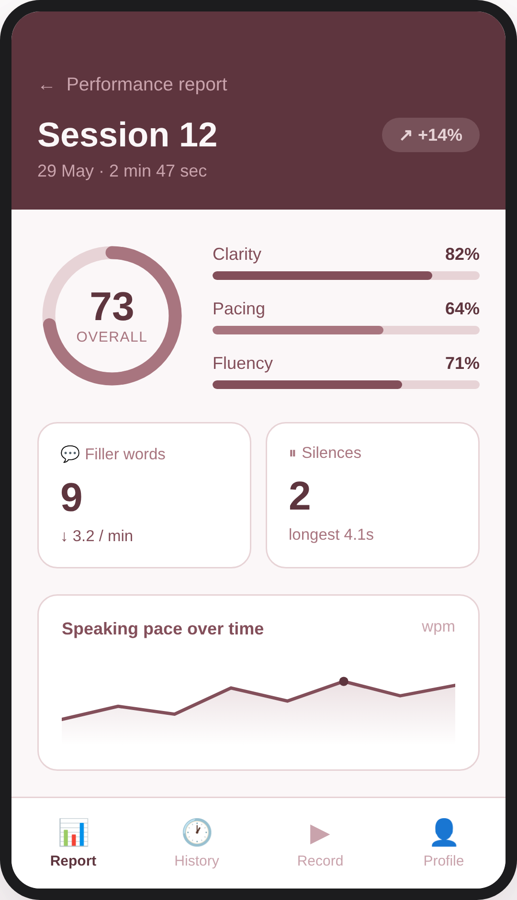

<div align="center">

# 🎤 InterviewPro

### Your Personal AI Communication Coach

*Record. Analyze. Improve. — Master your interview delivery with objective, data-driven feedback.*

<br>


<br>

**Technion CS 236272 · Project in Android Development · 2026**

</div>

---

## 📖 Motivation

In today's competitive job market, **soft skills are as crucial as technical knowledge.** Many candidates fail interviews due to poor delivery — lack of eye contact, a nervous pace, or excessive filler words like *"umm"* and *"like."*

**InterviewPro** is a **"Smart AI Mirror"**: you record a practice interview, and the app gives you objective, quantitative feedback on exactly how you came across — so you can improve with **numbers, not guesses.**

---

## ✨ Features

| 🎯 Feature | What it does | Status |
|-----------|--------------|:------:|
| 🔐 **Private Accounts** | Secure email/password login — sessions stay private and synced | ✅ |
| 🎥 **Record & Replay** | Capture practice interviews and replay them to hear your tone | ✅ |
| 📝 **Full Transcript** | AI speech-to-text (OpenAI Whisper) of everything you said | ✅ |
| 🗣️ **Filler Word Detection** | Counts every *"um," "like," "you know"* with a per-minute rate | ✅ |
| 📚 **Vocabulary Analysis** | Flags overused words and measures vocabulary diversity | ✅ |
| ⏸️ **Silence Detection** | Spots long, awkward pauses that break your flow | ✅ |
| 📊 **Progress Comparison** | Compares any two sessions side-by-side to track improvement | ✅ |
| 📈 **Performance Report** | A single score plus skill breakdown, stats, and a pace chart | ✅ |

---

## 📱 The Experience

<div align="center">



*Performance Report — overall score, skill breakdown, key metrics, and speaking-pace trend, all in one glance.*

</div>

---

## 🗺️ Roadmap

### ✅ Sprint 1 — Core Analysis Engine `COMPLETE`

| # | User Story | Status |
|:-:|-----------|:------:|
| #6 | Private account for safe, synced practice data | ✅ |
| #9 | Save and replay recordings | ✅ |
| #10 | Read a text transcript of everything I said | ✅ |
| #3 | Detect and count filler words (*"umm," "like"*) | ✅ |
| #4 | Flag over-repeated professional words | ✅ |
| #5 | Flag long or awkward silences | ✅ |
| #8 | Compare latest practice with a previous one | ✅ |

### 🚧 Sprint 2 — Live Coaching & Visual Insight `PLANNED`

| # | User Story |
|:-:|-----------|
| #11 | AI coaching tips at session end, with rephrasing suggestions |
| #12 | Detect if I sound confident, nervous, or bored |
| #7 | Visual graphs of improvement over weeks |
| #14 | Feedback on hand gestures & body language |
| #15 | Visual map of where I was looking on screen |

### 💡 Nice to Have — Advanced Behavioral Analysis `BACKLOG`

| # | User Story |
|:-:|-----------|
| #16 | Emotional tone detection (nervous / happy / bored) |
| #17 | Detect if I scan the whole "audience" vs. one fixed point |
| #18 | Hand-gesture analysis for more engaging body language |

---

## 🛠️ Built With

**Flutter 3.38.3** · **Dart** · **Firebase** (Auth + Firestore) · **OpenAI Whisper** · **fl_chart** · **Provider**

---

## 🚀 Run It

```bash
git clone https://github.com/Technion236272/2026b-InterviewPro.git
cd 2026b-InterviewPro
fvm use 3.38.3
fvm flutter pub get
flutterfire configure                       # connect your own Firebase
echo "OPENAI_API_KEY=sk-your-key" > .env     # add your Whisper key
fvm flutter run
```

<div align="center">
<br>

*Built with Flutter 💙 · Powered by OpenAI Whisper*

</div>